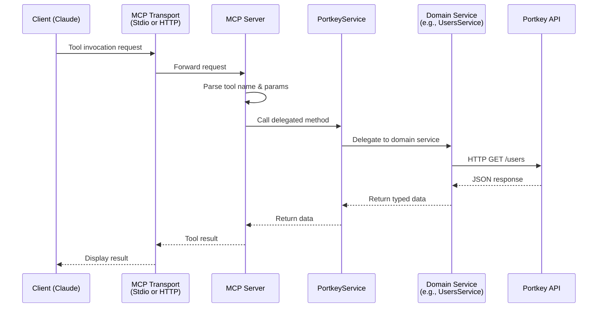

<div align="center">

# Portkey Admin MCP Server

<picture>
  <source media="(prefers-color-scheme: dark)" srcset="https://readme-typing-svg.demolab.com?font=Fira+Code&pause=1000&color=FFFFFF&center=true&vCenter=true&width=500&lines=151+tools+for+Portkey+Admin+API;Prompts%2C+Configs%2C+Analytics;Full+MCP+Protocol+1.0+Server">
  <source media="(prefers-color-scheme: light)" srcset="https://readme-typing-svg.demolab.com?font=Fira+Code&pause=1000&color=000000&center=true&vCenter=true&width=500&lines=151+tools+for+Portkey+Admin+API;Prompts%2C+Configs%2C+Analytics;Full+MCP+Protocol+1.0+Server">
  
</picture>

MCP server for [Portkey](https://portkey.ai/) Admin API. **151 tools** for prompts, configs, analytics, MCP server management & more.

</div>

<p align="center">
  <a href="https://nodejs.org/"></a>
  <a href="https://www.typescriptlang.org/"></a>
</p>

<p align="center">
  <a href="https://opensource.org/licenses/MIT"></a>
  <a href="./ENDPOINTS.md"></a>
</p>

---

## 📑 Contents

- [🚀 Quick Start](#-quick-start)
- [✨ Features](#-features)
- [🔧 Tools](#-tools-151)
- [🏗️ Architecture](#-architecture)
- [🚢 Deployment](#-deployment)
- [▲ Vercel Guide](./docs/VERCEL_DEPLOYMENT.md)
- [🔐 Security Policy](./SECURITY.md)
- [⚠️ Limitations](#-limitations)

---

## 🚀 Quick Start

### Installation Methods

| Method | Type | Setup |
|--------|------|-------|
| `npx portkey-admin-mcp` | Zero-install | Runs directly via npx |
| [](https://github.com/s-b-e-n-s-o-n/portkey-admin-mcp) | Self-hosted | `docker pull` or build from source |

### npx (Recommended)

```bash
PORTKEY_API_KEY=your_key npx -y portkey-admin-mcp
```

<details>
<summary><strong>Claude Code</strong></summary>

```bash
claude mcp add -e PORTKEY_API_KEY=your_key portkey -- npx -y portkey-admin-mcp
```

</details>

<details>
<summary><strong>Cursor / Windsurf / VS Code</strong></summary>

Add to your MCP config (`.cursor/mcp.json`, `.windsurf/mcp.json`, or `.vscode/mcp.json`):

```json
{
  "mcpServers": {
    "portkey": {
      "command": "npx",
      "args": ["-y", "portkey-admin-mcp"],
      "env": {
        "PORTKEY_API_KEY": "your_api_key"
      }
    }
  }
}
```

</details>

---

<details>
<summary><strong>🔨 Build from source</strong></summary>

```bash
git clone https://github.com/s-b-e-n-s-o-n/portkey-admin-mcp.git
cd portkey-admin-mcp
npm install
npm run build
```

Then use this config:
```json
{
  "mcpServers": {
    "portkey": {
      "command": "node",
      "args": ["/path/to/portkey-admin-mcp/build/index.js"],
      "env": {
        "PORTKEY_API_KEY": "your_api_key"
      }
    }
  }
}
```

</details>

---

## ✨ Features

<table>
<tr>
<td align="center" width="33%">
<h3>📝 Prompt Management</h3>
Create, version, render & execute prompts
</td>
<td align="center" width="33%">
<h3>⚡ Gateway Configs</h3>
Loadbalancing, fallbacks, caching
</td>
<td align="center" width="33%">
<h3>📊 Analytics</h3>
Cost, latency, errors, feedback
</td>
</tr>
<tr>
<td align="center">
<h3>🛡️ Governance</h3>
Rate limits, usage limits, guardrails
</td>
<td align="center">
<h3>🔍 Observability</h3>
Logs, traces, audit trails
</td>
<td align="center">
<h3>🔐 Access Control</h3>
Users, workspaces, API keys
</td>
</tr>
</table>

---

## 🔧 Tools (151)

<details>
<summary><strong>👥 User & Access</strong> (10 tools)</summary>

| Tool | Description |
|------|-------------|
| `list_all_users` | List all users in organization |
| `get_user` | Get user details |
| `update_user` | Update user |
| `delete_user` | Remove user |
| `invite_user` | Invite a new user |
| `list_user_invites` | List pending invites |
| `get_user_invite` | Get invite details |
| `delete_user_invite` | Cancel invite |
| `resend_user_invite` | Resend invite email |
| `get_user_stats` | Get user statistics |

</details>

<details>
<summary><strong>🏢 Workspaces</strong> (10 tools)</summary>

| Tool | Description |
|------|-------------|
| `list_workspaces` | List all workspaces |
| `get_workspace` | Get workspace details |
| `create_workspace` | Create workspace |
| `update_workspace` | Update workspace |
| `delete_workspace` | Delete workspace |
| `add_workspace_member` | Add member to workspace |
| `list_workspace_members` | List workspace members |
| `get_workspace_member` | Get member details |
| `update_workspace_member` | Update member role |
| `remove_workspace_member` | Remove member |

</details>

<details>
<summary><strong>⚙️ Configs</strong> (6 tools)</summary>

| Tool | Description |
|------|-------------|
| `list_configs` | List gateway configs |
| `get_config` | Get config details |
| `create_config` | Create config |
| `update_config` | Update config |
| `delete_config` | Delete config |
| `list_config_versions` | List config version history |

</details>

<details>
<summary><strong>🔑 API & Virtual Keys</strong> (10 tools)</summary>

| Tool | Description |
|------|-------------|
| `list_api_keys` | List API keys |
| `create_api_key` | Create API key |
| `get_api_key` | Get API key details |
| `update_api_key` | Update API key |
| `delete_api_key` | Delete API key |
| `list_virtual_keys` | List virtual keys |
| `create_virtual_key` | Create virtual key |
| `get_virtual_key` | Get virtual key details |
| `update_virtual_key` | Update virtual key |
| `delete_virtual_key` | Delete virtual key |

</details>

<details>
<summary><strong>📁 Collections</strong> (5 tools)</summary>

| Tool | Description |
|------|-------------|
| `list_collections` | List prompt collections |
| `create_collection` | Create a collection |
| `get_collection` | Get collection details |
| `update_collection` | Update collection |
| `delete_collection` | Delete collection |

</details>

<details>
<summary><strong>📝 Prompts</strong> (14 tools)</summary>

| Tool | Description |
|------|-------------|
| `list_prompts` | List prompts |
| `create_prompt` | Create a prompt template |
| `get_prompt` | Get prompt details |
| `update_prompt` | Update a prompt |
| `delete_prompt` | Delete prompt |
| `publish_prompt` | Publish prompt version |
| `list_prompt_versions` | List version history |
| `get_prompt_version` | Get specific version details |
| `update_prompt_version` | Update version (assign label) |
| `render_prompt` | Render prompt with variables |
| `run_prompt_completion` | Execute prompt completion |
| `migrate_prompt` | Create-or-update prompt |
| `promote_prompt` | Promote prompt between environments |
| `validate_completion_metadata` | Validate billing metadata |

</details>

<details>
<summary><strong>🧩 Prompt Partials</strong> (7 tools)</summary>

| Tool | Description |
|------|-------------|
| `create_prompt_partial` | Create reusable partial |
| `list_prompt_partials` | List partials |
| `get_prompt_partial` | Get partial details |
| `update_prompt_partial` | Update partial |
| `delete_prompt_partial` | Delete partial |
| `list_partial_versions` | List partial versions |
| `publish_partial` | Publish partial version |

</details>

<details>
<summary><strong>🏷️ Prompt Labels</strong> (5 tools)</summary>

| Tool | Description |
|------|-------------|
| `create_prompt_label` | Create label |
| `list_prompt_labels` | List labels |
| `get_prompt_label` | Get label details |
| `update_prompt_label` | Update label |
| `delete_prompt_label` | Delete label |

</details>

<details>
<summary><strong>🛡️ Guardrails</strong> (5 tools)</summary>

| Tool | Description |
|------|-------------|
| `list_guardrails` | List guardrails |
| `create_guardrail` | Create guardrail |
| `get_guardrail` | Get guardrail details |
| `update_guardrail` | Update guardrail |
| `delete_guardrail` | Delete guardrail |

</details>

<details>
<summary><strong>📏 Usage Limits</strong> (7 tools)</summary>

| Tool | Description |
|------|-------------|
| `list_usage_limits` | List usage limits |
| `create_usage_limit` | Create usage limit |
| `get_usage_limit` | Get limit details |
| `update_usage_limit` | Update limit |
| `delete_usage_limit` | Delete limit |
| `list_usage_limit_entities` | List entities tracked against a limit |
| `reset_usage_limit_entity` | Reset entity usage |

</details>

<details>
<summary><strong>⏱️ Rate Limits</strong> (5 tools)</summary>

| Tool | Description |
|------|-------------|
| `list_rate_limits` | List rate limits |
| `create_rate_limit` | Create rate limit |
| `get_rate_limit` | Get rate limit details |
| `update_rate_limit` | Update rate limit |
| `delete_rate_limit` | Delete rate limit |

</details>

<details>
<summary><strong>📜 Audit</strong> (1 tool)</summary>

| Tool | Description |
|------|-------------|
| `list_audit_logs` | List audit log entries |

</details>

<details>
<summary><strong>📊 Analytics</strong> (20 tools)</summary>

| Tool | Description |
|------|-------------|
| `get_cost_analytics` | Cost analytics over time |
| `get_request_analytics` | Request count analytics |
| `get_token_analytics` | Token usage analytics |
| `get_latency_analytics` | Latency analytics |
| `get_error_analytics` | Error count analytics |
| `get_error_rate_analytics` | Error rate analytics |
| `get_error_stacks_analytics` | Error status code stacks |
| `get_error_status_codes_analytics` | Unique error status codes |
| `get_users_analytics` | User activity metrics |
| `get_user_requests_analytics` | Per-user request counts |
| `get_cache_hit_latency` | Cache hit latency |
| `get_cache_hit_rate` | Cache hit rate |
| `get_rescued_requests_analytics` | Rescued requests (retry/fallback) |
| `get_feedback_analytics` | Feedback submissions over time |
| `get_feedback_models_analytics` | Feedback by AI model |
| `get_feedback_scores_analytics` | Feedback score distribution |
| `get_feedback_weighted_analytics` | Weighted feedback metrics |
| `get_analytics_group_users` | Analytics grouped by user |
| `get_analytics_group_models` | Analytics grouped by model |
| `get_analytics_group_metadata` | Analytics grouped by metadata key |

</details>

<details>
<summary><strong>📋 Logging</strong> (8 tools)</summary>

| Tool | Description |
|------|-------------|
| `insert_log` | Insert log entry |
| `create_log_export` | Create log export |
| `list_log_exports` | List exports |
| `get_log_export` | Get export details |
| `update_log_export` | Update export |
| `start_log_export` | Start export job |
| `cancel_log_export` | Cancel export |
| `download_log_export` | Download export |

</details>

<details>
<summary><strong>🔍 Tracing</strong> (3 tools)</summary>

| Tool | Description |
|------|-------------|
| `create_feedback` | Create feedback |
| `update_feedback` | Update feedback |
| `get_trace` | Get trace details |

</details>

<details>
<summary><strong>🔌 Providers</strong> (5 tools)</summary>

| Tool | Description |
|------|-------------|
| `list_providers` | List providers |
| `create_provider` | Create provider |
| `get_provider` | Get provider details |
| `update_provider` | Update provider |
| `delete_provider` | Delete provider |

</details>

<details>
<summary><strong>🔗 Integrations</strong> (10 tools)</summary>

| Tool | Description |
|------|-------------|
| `list_integrations` | List integrations |
| `create_integration` | Create integration |
| `get_integration` | Get integration details |
| `update_integration` | Update integration |
| `delete_integration` | Delete integration |
| `list_integration_models` | List custom models |
| `update_integration_models` | Update custom models |
| `delete_integration_model` | Delete custom model |
| `list_integration_workspaces` | List workspace access |
| `update_integration_workspaces` | Update workspace access |

</details>

<details>
<summary><strong>🔌 MCP Integrations</strong> (10 tools)</summary>

| Tool | Description |
|------|-------------|
| `list_mcp_integrations` | List MCP integrations |
| `create_mcp_integration` | Create MCP integration |
| `get_mcp_integration` | Get integration details |
| `update_mcp_integration` | Update integration |
| `delete_mcp_integration` | Delete integration |
| `get_mcp_integration_metadata` | Get sync metadata |
| `list_mcp_integration_capabilities` | List capabilities |
| `update_mcp_integration_capabilities` | Enable/disable capabilities |
| `list_mcp_integration_workspaces` | List workspace access |
| `update_mcp_integration_workspaces` | Update workspace access |

</details>

<details>
<summary><strong>🖥️ MCP Servers</strong> (10 tools)</summary>

| Tool | Description |
|------|-------------|
| `list_mcp_servers` | List MCP servers |
| `create_mcp_server` | Register MCP server |
| `get_mcp_server` | Get server details |
| `update_mcp_server` | Update server |
| `delete_mcp_server` | Delete server |
| `test_mcp_server` | Test server connectivity |
| `list_mcp_server_capabilities` | List capabilities |
| `update_mcp_server_capabilities` | Enable/disable capabilities |
| `list_mcp_server_user_access` | List user access |
| `update_mcp_server_user_access` | Update user access |

</details>

---

## 🏗️ Architecture



---

## 🚢 Deployment

### Transports

| Transport | Entrypoint | Use Case |
|-----------|------------|----------|
| `stdio` | `node build/index.js` | Local CLI tools (Claude Code, Cursor) |
| `Streamable HTTP` | `node build/server.js` | Remote clients, web, production |

`MCP_TRANSPORT` is retained for compatibility, but transport selection is done by choosing the correct entrypoint.

### Session Modes (HTTP)

| Mode | Env | Best For | Tradeoff |
|------|-----|----------|----------|
| Stateful | `MCP_SESSION_MODE=stateful` (default) | Single-instance always-on services | Session transport state is in memory |
| Stateless | `MCP_SESSION_MODE=stateless` | Autoscaling/serverless (Render scale-out, Vercel, Cloud Run) | `DELETE /mcp` not used; no server-side session tracking |

### Recommended Hosted Defaults (Team Setup)

For shared/team hosting, use:

- `MCP_SESSION_MODE=stateless`
- `MCP_EVENT_STORE=redis`
- `MCP_REDIS_URL=...` (or `REDIS_URL=...`)
- `MCP_AUTH_MODE=clerk` (or `bearer` for internal-only setups)
- `ALLOWED_ORIGINS=https://your-app-domain`
- `MCP_READY_CHECK_MODE=portkey`

This keeps MCP request handling stateless while preserving stream resumability across instances.

### Event Store Modes

| Mode | Env | Default | Purpose |
|------|-----|---------|---------|
| Off | `MCP_EVENT_STORE=off` | `stateful` mode | No resumability store |
| Memory | `MCP_EVENT_STORE=memory` | `stateless` mode | In-process resumability |
| Redis | `MCP_EVENT_STORE=redis` + `MCP_REDIS_URL` or `REDIS_URL` | none | Shared resumability across instances |

`MCP_EVENT_TTL_SECONDS` controls retention (default `3600`).
When `MCP_EVENT_STORE=redis`, the server resolves Redis URL in this order:
`MCP_REDIS_URL` first, then `REDIS_URL`.

### HTTP Mode

```bash
PORTKEY_API_KEY=your_key \
MCP_HOST=0.0.0.0 \
MCP_PORT=3000 \
MCP_SESSION_MODE=stateful \
MCP_EVENT_STORE=off \
MCP_AUTH_MODE=bearer \
MCP_AUTH_TOKEN=replace_with_long_random_secret \
node build/server.js
```

Exposes a single `/mcp` endpoint with session management via `Mcp-Session-Id` header.

### HTTPS Mode (Native TLS)

```bash
PORTKEY_API_KEY=your_key \
MCP_HOST=0.0.0.0 \
MCP_PORT=3443 \
MCP_TLS_KEY_PATH=/etc/ssl/private/server.key \
MCP_TLS_CERT_PATH=/etc/ssl/certs/server.crt \
MCP_AUTH_MODE=clerk \
CLERK_ISSUER=https://your-clerk-domain \
node build/server.js
```

If you host behind a platform/load balancer (Vercel, Cloud Run, Fly, Nginx, Cloudflare), leave `MCP_TLS_*` unset and let the platform terminate HTTPS.

### Clerk Auth (HTTP)

```bash
PORTKEY_API_KEY=your_key \
MCP_HOST=0.0.0.0 \
MCP_PORT=3000 \
MCP_SESSION_MODE=stateless \
MCP_EVENT_STORE=redis \
MCP_REDIS_URL=redis://localhost:6379 \
MCP_AUTH_MODE=clerk \
CLERK_ISSUER=https://your-clerk-domain \
CLERK_AUDIENCE=your-audience \
node build/server.js
```

### Vercel

This repo includes Vercel routing files:

- `api/index.ts` - Vercel function entrypoint
- `vercel.json` - rewrites `/`, `/mcp`, `/health`, `/ready`, `/auth/info` to that function

Full setup guide (including public-repo security checklist):
- [`docs/VERCEL_DEPLOYMENT.md`](./docs/VERCEL_DEPLOYMENT.md)

Recommended Vercel environment variables:

- `PORTKEY_API_KEY=...`
- `MCP_SESSION_MODE=stateless`
- `MCP_EVENT_STORE=redis`
- `MCP_REDIS_URL=redis://...`
- `MCP_AUTH_MODE=clerk` (or `bearer`)
- `CLERK_ISSUER=https://your-clerk-domain` (required when `MCP_AUTH_MODE=clerk`)
- `CLERK_AUDIENCE=your-audience` (required when `MCP_AUTH_MODE=clerk`)
- `ALLOWED_ORIGINS=https://your-app-domain`
- `MCP_TRUST_PROXY=true`
- `MCP_READY_CHECK_MODE=portkey`

Notes:

- Leave `MCP_TLS_*` unset on Vercel (Vercel terminates HTTPS).
- Keep MCP on Streamable HTTP/SSE (Vercel does not support WebSockets).
- `vercel.json` sets function `maxDuration` to `300`; adjust based on your plan limits.
- For public repos, never commit keys; keep all credentials in Vercel Environment Variables only.

### Quick MCP HTTP Test

After starting the HTTP server, run:

```bash
npm run test:http
```

Optional overrides:

- `MCP_TEST_BASE_URL=https://your-host`
- `MCP_TEST_MCP_URL=https://your-host/mcp`
- `MCP_TEST_BEARER_TOKEN=...` (or `MCP_TEST_AUTH_HEADER='Authorization: Bearer ...'`)

The script verifies `/health`, `/ready`, runs `initialize`, then runs `tools/list`.

### Docker

```bash
docker build -t portkey-admin-mcp .
docker run \
  -e PORTKEY_API_KEY=your_key \
  -e MCP_HOST=0.0.0.0 \
  -e MCP_PORT=3000 \
  -e MCP_AUTH_MODE=bearer \
  -e MCP_AUTH_TOKEN=replace_with_long_random_secret \
  -p 3000:3000 \
  portkey-admin-mcp
```

### Health Endpoints

- `GET /` - Web status/auth helper page
- `GET /auth/info` - Auth metadata (auth mode, session mode, event store mode, Clerk config flags, MCP endpoint URL)
- `GET /health` - Server status
- `GET /ready` - Readiness state (includes session mode/event store mode, and optional Portkey connectivity when `MCP_READY_CHECK_MODE=portkey`)

---

## ⚠️ Limitations

### Enterprise Features

The following require a Portkey Enterprise plan with Admin API keys:

- Analytics (cost, request, token, latency, error, cache, feedback)
- Log exports
- Audit logs
- User management (list users, invites)
- Provider creation

### Scope-Gated Endpoints (Verified 2026-02-25)

Most `403` responses include Portkey error code `AB03` ("not enough permissions").
This indicates missing API key scopes, not broken endpoint paths.

| Endpoint Group | Typical Failing Tools | Required Scope(s) |
|------|------|------|
| Users | `list_all_users`, `get_user` | `users.list`, `users.view` |
| User Invites | `list_user_invites`, `get_user_invite` | `users.invites.list`, `users.invites.view` |
| API Keys | `list_api_keys`, `get_api_key` | `apiKeys.list`, `apiKeys.view` (+ API key management feature) |
| Audit Logs | `list_audit_logs` | `auditLogs.list` |
| Analytics Graphs | `get_cost_analytics`, `get_request_analytics`, etc. | `analytics.view` |
| Analytics Groups | `get_user_grouped_data` | `analytics.groups.view` |
| Integration Access | `list_integration_models`, `list_integration_workspaces` | `integrations.models.list`, `integrations.workspaces.list` |

---

## 🛠️ Development

```bash
npm run dev           # stdio with hot reload
npm run dev:http      # HTTP with hot reload
npm run test:e2e      # MCP protocol tests
npm run test:contract # API contract tests
npm run ci            # full CI pipeline (lint + typecheck + test + build + verify)
```

---

<div align="center">

### Built With

[](#)
[](#)
[](#)

---

**MIT License** · Inspired by [r-huijts/portkey-admin-mcp-server](https://github.com/r-huijts/portkey-admin-mcp-server)

<a href="#portkey-admin-mcp-server">↑ Back to top</a>

</div>
