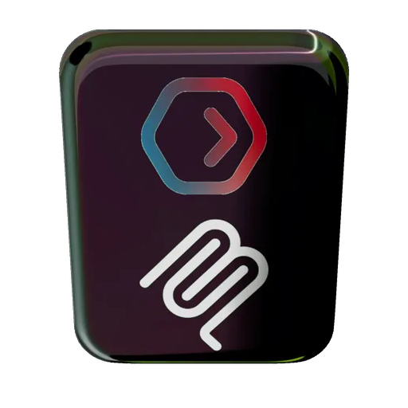

<div align="center">



<h1>Portkey Admin MCP Server</h1>

**The [Portkey](https://portkey.ai/) Admin API as an MCP server — 178 tools across prompts, configs, keys, analytics, governance, deployments, and more.**

</div>

<p align="center">
  <a href="https://www.npmjs.com/package/portkey-admin-mcp"></a>
  <a href="https://nodejs.org/"></a>
  <a href="https://opensource.org/licenses/MIT"></a>
</p>

<p align="center">
  <a href="https://github.com/CodesWhat/portkey-admin-mcp/actions/workflows/ci.yml"></a>
  <a href="https://securityscorecards.dev/viewer/?uri=github.com/CodesWhat/portkey-admin-mcp"></a>
  <a href="https://www.bestpractices.dev/projects/14031"></a>
  <a href="https://qlty.sh/gh/CodesWhat/projects/portkey-admin-mcp"></a>
  <a href="https://qlty.sh/gh/CodesWhat/projects/portkey-admin-mcp"></a>
</p>

<p align="center">
  <a href="https://www.npmjs.com/package/portkey-admin-mcp"></a>
  <a href="https://github.com/punkpeye/awesome-mcp-servers"></a>
  <a href="https://registry.modelcontextprotocol.io/v0/servers?search=io.github.CodesWhat/portkey-admin-mcp"></a>
  <a href="https://github.com/sponsors/CodesWhat"></a>
</p>

<hr>

> [!IMPORTANT]
> **Active compatibility development.** Palo Alto Networks completed its Portkey acquisition on 2026‑05‑29 and now presents Portkey as the core of Prisma AIRS AI Gateway. The Portkey Admin API remains live, and its official OpenAPI and product changelog continued adding control-plane surfaces through August 2026; this project has therefore resumed API-coverage work. It targets the Portkey-compatible API (`x-portkey-api-key`), not Prisma AIRS/Strata Cloud Manager directly. Prisma AIRS AI Gateway currently has a different management and authentication surface, so it is not a `PORTKEY_BASE_URL` swap. See the short [Prisma AIRS interoperability guide](./docs/PRISMA_AIRS_INTEROPERABILITY.md) for the supported side-by-side model and adapter criteria.

<h2 align="center">Contents</h2>

- [Quick Start](#quick-start)
- [What You Can Do](#what-you-can-do)
- [API Key Scopes](#api-key-scopes)
- [HTTP Server (Experimental)](#http-server)
- [Architecture](./docs/ARCHITECTURE.md)
- [Prisma AIRS interoperability](./docs/PRISMA_AIRS_INTEROPERABILITY.md)
- [Verify a release](./docs/VERIFY_RELEASE.md)
- [Development](#development)
- [Community](#community)
- [Contributing](./CONTRIBUTING.md)
- [Governance](./GOVERNANCE.md)
- [Security assurance](./SECURITY-ASSURANCE.md)
- [Full tool list — ENDPOINTS.md](./ENDPOINTS.md)

<hr>

<h2 align="center" id="quick-start">Quick Start</h2>

You need a **Portkey API key** with appropriate scopes. Get one from your [Portkey dashboard](https://app.portkey.ai/) under API Keys.

### Claude Code

```bash
claude mcp add -e PORTKEY_API_KEY=your_key portkey-admin -- npx -y portkey-admin-mcp
```

### Cursor / Windsurf / VS Code

Add to your MCP config (`.cursor/mcp.json`, `.windsurf/mcp.json`, or `.vscode/mcp.json`):

```json
{
  "mcpServers": {
    "portkey-admin": {
      "command": "npx",
      "args": ["-y", "portkey-admin-mcp"],
      "env": {
        "PORTKEY_API_KEY": "your_api_key"
      }
    }
  }
}
```

### Run directly

```bash
PORTKEY_API_KEY=your_key npx -y portkey-admin-mcp
```

To expose only a focused subset of tools in stdio clients, set `PORTKEY_TOOL_DOMAINS`:

```bash
PORTKEY_API_KEY=your_key \
PORTKEY_TOOL_DOMAINS=prompts,analytics \
npx -y portkey-admin-mcp
```

Scoping domains is also the biggest lever on context cost, not just access. `tools/list`
is paginated, and the complete 178-tool catalog is roughly 400 KB once a
client follows `nextCursor` through every page. Narrowing to the domains a client
actually needs cuts that roughly proportionally.

<details>
<summary><strong>Build from source</strong></summary>

```bash
git clone https://github.com/CodesWhat/portkey-admin-mcp.git
cd portkey-admin-mcp
npm install && npm run build
```

Then use this config:
```json
{
  "mcpServers": {
    "portkey-admin": {
      "command": "node",
      "args": ["/path/to/portkey-admin-mcp/build/index.js"],
      "env": {
        "PORTKEY_API_KEY": "your_api_key"
      }
    }
  }
}
```

</details>

<hr>

<h2 align="center" id="what-you-can-do">What You Can Do</h2>

| Category | Tools | Examples |
|----------|-------|---------|
| **Prompts** | 14 | Create, version, render, execute, migrate, promote prompts |
| **Prompt Partials** | 7 | Reusable prompt fragments with versioning |
| **Prompt Labels** | 5 | Organize prompt versions (production, staging, dev) |
| **Configs** | 6 | Gateway routing, caching, retry, loadbalancing |
| **Deployments** | 5 | Register, inspect, update, and archive self-hosted Gateways |
| **API Keys** | 6 | Create, rotate, and manage scoped API keys |
| **Secret References** | 5 | Manage AWS, Azure, and HashiCorp external-secret references |
| **Virtual Keys** | 5 | Manage provider access keys |
| **Collections** | 5 | Group prompts by app or project |
| **Providers** | 5 | Manage AI provider configurations |
| **Integrations** | 11 | Provider integrations, model pricing, models, workspace access |
| **MCP Integrations** | 10 | External MCP tool integrations |
| **MCP Servers** | 12 | MCP server registry, capabilities, and live connections |
| **Guardrails** | 11 | Content safety policies, organisation defaults, workspace exclusions |
| **Usage Limits** | 7 | Cost and token consumption limits |
| **Rate Limits** | 5 | Request frequency controls |
| **Analytics** | 22 | Cost, latency, errors, tokens, cache, feedback, provider groups |
| **Logging** | 10 | Log retrieval, ingestion, export, and field restrictions |
| **Tracing** | 2 | Feedback creation and updates on traces |
| **Users & Workspaces** | 24 | User management, invites, workspace members, SCIM group mappings |
| **Audit** | 1 | Audit log access |

**178 tools total across 20 tool domains.** See [ENDPOINTS.md](./ENDPOINTS.md) for the full list with descriptions.

Portkey's newer product language increasingly presents provider credentials as
Providers, while the current Admin API still exposes both `/virtual-keys` and
`/providers`. This server keeps both domains: Virtual Keys manage provider access
credentials, and Providers manage workspace provider configurations.

<hr>

<h2 align="center" id="api-key-scopes">API Key Scopes</h2>

Most tools work with a **workspace-scoped service key** that has Select All permissions enabled. That covers prompts, configs, virtual/API keys, providers, guardrails, workspace integrations, MCP servers, rate/usage limits, logs, prompt completions, and workspace user management.

If a tool returns a `403` with Portkey error `AB03`, it means missing scopes — not a broken endpoint.

<details>
<summary><strong>Enterprise-gated tools and other scope requirements</strong></summary>

### Enterprise-gated tools (53)

The following tools require an **organisation-level scope that is only available on Portkey Enterprise plans**. They return `403 You do not have enough permissions to execute this request` on workspace plans. Their descriptions include an `Enterprise-gated. Returns 403 on non-Enterprise Portkey plans.` suffix so MCP clients know upfront.

| Area | Tools | Required scope |
|---|---|---|
| Analytics (22) | `get_cost_analytics`, `get_request_analytics`, `get_token_analytics`, `get_latency_analytics`, `get_error_analytics`, `get_error_rate_analytics`, `get_cache_hit_latency`, `get_cache_hit_rate`, `get_cache_summary`, `get_users_analytics`, `get_error_stacks_analytics`, `get_error_status_codes_analytics`, `get_user_requests_analytics`, `get_rescued_requests_analytics`, `get_feedback_analytics`, `get_feedback_models_analytics`, `get_feedback_scores_analytics`, `get_feedback_weighted_analytics`, `get_analytics_group_users`, `get_analytics_group_models`, `get_analytics_group_metadata`, `get_analytics_group_providers` | org-level `analytics.view` |
| Deployments (5) | `list_deployments`, `register_deployment`, `get_deployment`, `update_deployment`, `archive_deployment` | Enterprise deployment administration |
| Audit | `list_audit_logs` | `audit_logs.list` |
| Org-level integrations | `get_integration`, `list_integration_models`, `list_integration_workspaces` | `organisation_integrations.read` |
| Org-level users | `list_all_users`, `get_user`, `get_user_stats`, `list_user_invites` | `organisation_users.list` / `organisation_users.read` |
| Organisation guardrails (6) | `get_organisation_defaults`, `update_organisation_defaults`, `list_input_guardrail_workspace_exclusions`, `update_input_guardrail_workspace_exclusions`, `list_output_guardrail_workspace_exclusions`, `update_output_guardrail_workspace_exclusions` | `organisation_settings.read/update` and `organisation_exclusions.list/update` |
| Log exports (8) | `create_log_export`, `list_log_exports`, `get_log_export`, `start_log_export`, `cancel_log_export`, `download_log_export`, `update_log_export`, `get_log_export_field_restrictions` | Enterprise Logs Export + `logs.export` |
| SCIM groups (4) | `list_scim_groups`, `list_scim_workspace_mappings`, `create_scim_workspace_mapping`, `delete_scim_workspace_mapping` | SCIM enabled + organisation admin access |

### Other scope requirements

| Feature | Required |
|---------|----------|
| Prompt completions (`run_prompt_completion`) | `completions.write` scope + billing metadata (`app`, `env`) |
| Org-level service API key creation via `create_api_key` | `organisation_service_api_keys.create` (Enterprise) |

</details>

<hr>

<h2 align="center" id="http-server">HTTP Server (Experimental)</h2>

> **Status**: The HTTP transport works locally and is covered by the integration test suite, but it is a proof of concept — there is **no hosted version** of this server, and hosted deployment is not currently a goal. Use stdio (npx) as the supported transport.

The server supports Streamable HTTP for remote access:

```bash
PORTKEY_API_KEY=your_key \
MCP_HOST=127.0.0.1 \
MCP_PORT=3000 \
MCP_PUBLIC_BASE_URL=https://mcp.example.com \
MCP_AUTH_MODE=bearer \
MCP_AUTH_TOKEN=your_secret \
node build/server.js
```

Or via npx (the `portkey-admin-mcp` package includes the HTTP binary):
```bash
PORTKEY_API_KEY=your_key MCP_AUTH_MODE=bearer MCP_AUTH_TOKEN=your_secret \
  npx -y -p portkey-admin-mcp portkey-admin-mcp-http
```

For local-only HTTP use, leave `MCP_HOST` at its default `127.0.0.1`. Set `MCP_HOST=0.0.0.0` only when you intentionally need to accept connections from outside the local machine, such as Docker or a reverse proxy on another interface.

<details>
<summary><strong>Full environment variable reference</strong></summary>

| Variable | Default | Description |
|----------|---------|-------------|
| `PORTKEY_API_KEY` | (required) | Your Portkey API key |
| `PORTKEY_BASE_URL` | `https://api.portkey.ai/v1` | Portkey Admin API base URL. Prisma AIRS/SCM URLs are not compatible; credentialed requests never auto-follow redirects |
| `PORTKEY_ALLOW_PRIVATE_BASE_URL` | — | Set to `true` to allow a literal loopback/private `PORTKEY_BASE_URL` |
| `PORTKEY_ALLOW_INSECURE_HTTP` | — | Separately set to `true` only when a trusted self-hosted gateway cannot use HTTPS |
| `PORTKEY_TOOL_DOMAINS` | — | Server-side allowlist of the 20 domains: `users`, `workspaces`, `configs`, `deployments`, `keys`, `collections`, `prompts`, `analytics`, `guardrails`, `limits`, `audit`, `labels`, `partials`, `tracing`, `logging`, `providers`, `secret-references`, `integrations`, `mcp-integrations`, `mcp-servers`. HTTP `?tools=` may narrow it but cannot expand it |
| `MCP_HOST` | `127.0.0.1` | Bind address |
| `MCP_PORT` | `3000` | Port |
| `MCP_PUBLIC_BASE_URL` | — | Public absolute base URL to advertise from `/auth/info` and the status page; recommended for hosted deployments |
| `MCP_AUTH_MODE` | `none` | `none`, `bearer`, or `clerk` (`none` is blocked for HTTP unless explicitly overridden) |
| `MCP_AUTH_TOKEN` | — | Secret for bearer auth |
| `CLERK_ISSUER` / `CLERK_AUDIENCE` | — | Required issuer and audience when `MCP_AUTH_MODE=clerk` |
| `CLERK_ALLOWED_SUBJECTS` | — | Optional CSV subject allowlist for Clerk; at least one Clerk authorization policy is required |
| `CLERK_ALLOWED_ORGANIZATION_IDS` / `CLERK_ALLOWED_ROLES` | — | Optional CSV organization and role constraints; every configured constraint must match |
| `CLERK_REQUIRED_PERMISSIONS` | — | Optional CSV permissions that must all be present in the verified Clerk JWT |
| `MCP_ALLOW_UNAUTHENTICATED_HTTP` | — | Set to `true` only for intentional local unauthenticated HTTP debugging |
| `MCP_SESSION_MODE` | `stateful` | `stateful` or `stateless` |
| `MCP_MAX_SESSIONS` | `100` | Maximum concurrent stateful sessions or active stateless request handlers |
| `MCP_EVENT_STORE` | `off` | `off`, `memory`, or `redis`; stateless `GET /mcp` replay requires `memory` or `redis` |
| `MCP_EVENT_TTL_SECONDS` | `300` | Replay retention in seconds |
| `MCP_EVENT_STORE_MAX_EVENTS` | `10000` | Maximum events retained by the in-memory replay store; oldest events are evicted first |
| `MCP_EVENT_STORE_MAX_BYTES` | `67108864` | Approximate maximum serialized bytes retained by the in-memory replay store |
| `MCP_EVENT_STORE_COMMAND_TIMEOUT_MS` | `5000` | Redis command timeout for the event store, in milliseconds; `0` disables the timeout (restores unbounded pre-v6 behavior) |
| `MCP_REDIS_URL` | — | Redis URL for shared event store; production requires `rediss://` and ACL-scoped credentials |
| `MCP_EVENT_ENCRYPTION_KEY` | — | Required 32-byte base64 AES key for Redis replay payloads; generate with `openssl rand -base64 32` |
| `MCP_REDIS_KEY_PREFIX` | `mcp:event-store` | Dedicated Redis namespace for replay data |
| `MCP_TLS_KEY_PATH` | — | TLS key for native HTTPS |
| `MCP_TLS_CERT_PATH` | — | TLS cert for native HTTPS |
| `ALLOWED_ORIGINS` | — | CORS allow-list; also used to validate the `Host` header (DNS-rebinding protection) when `MCP_AUTH_MODE=none` |
| `MCP_TRUST_PROXY` | `loopback` | Express trust-proxy policy. Use an exact nonnegative hop count or trusted proxy subnet; `true` is rejected because it trusts forwarding headers from every peer |
| `RATE_LIMIT_STORE` | `memory` | `redis` for multi-instance/serverless deployments; production memory mode requires `RATE_LIMIT_SINGLE_PROCESS=true` |
| `RATE_LIMIT_REDIS_URL` | — | Shared limiter Redis URL, falling back to `MCP_REDIS_URL`/`REDIS_URL`; production requires `rediss://` |
| `RATE_LIMIT_REDIS_KEY_PREFIX` | `mcp:rate-limit` | Redis namespace for atomic pre-authentication IP and principal-plus-IP token buckets |
| `RATE_LIMIT_MAX_BUCKETS` | `10000` | Maximum local buckets in explicit memory mode before new clients share overflow capacity |

Production containers must choose their rate-limit topology explicitly: set
`RATE_LIMIT_STORE=redis` for multi-instance deployments, or set
`RATE_LIMIT_SINGLE_PROCESS=true` only for a single long-lived process.

</details>

<details>
<summary><strong>Vercel deployment</strong></summary>

Vercel support is kept as a reference proof of concept — we do not run a hosted deployment. See [docs/VERCEL_DEPLOYMENT.md](./docs/VERCEL_DEPLOYMENT.md) if you want to self-deploy.

Key points:
- Uses stateless request handling with encrypted, principal-bound Redis replay and a shared atomic Redis rate limiter
- Requires Clerk or bearer auth
- Leave `MCP_TLS_*` unset (Vercel terminates HTTPS)
- Set `MCP_PUBLIC_BASE_URL` to your deployment URL so advertised MCP endpoints never depend on request headers
- Vercel does not support WebSockets — Streamable HTTP/SSE only

</details>

<details>
<summary><strong>Docker</strong></summary>

```bash
docker build -t portkey-admin-mcp .
docker run \
  -e PORTKEY_API_KEY=your_key \
  -e MCP_TRANSPORT=http \
  -e MCP_HOST=0.0.0.0 \
  -e MCP_PORT=3000 \
  -e MCP_AUTH_MODE=bearer \
  -e MCP_AUTH_TOKEN=your_secret \
  -p 3000:3000 \
  portkey-admin-mcp
```

</details>

### Health Endpoints

| Path | Purpose |
|------|---------|
| `GET /health` | Server liveness |
| `GET /ready` | Readiness (includes optional Portkey connectivity check) |
| `GET /auth/info` | Auth configuration metadata |

<hr>

<h2 align="center" id="development">Development</h2>

```bash
npm run dev           # stdio with hot reload
npm run dev:http      # HTTP with hot reload
npm test              # unit + contract tests
npm run test:coverage # unit + contract tests with the enforced 80% line floor
npm run test:e2e      # MCP protocol tests
npm run test:http     # HTTP endpoint smoke test
npm run smoke         # credentialed read-only Portkey API smoke suite
npm run ci            # full pipeline (lint + typecheck + coverage + build + e2e + verify)
```

The live smoke suite reports expected credential-scope denials and the explicitly
tracked hosted control-plane route gaps as skips. Unexpected HTTP responses,
network errors, and response-contract failures still fail the run.

The required CI and release gates measure every TypeScript source file and fail
below 80% line coverage. The current full report is 98.19% lines, 91.92%
branches, and 98.58% functions.

`npm run dev:http` now requires `MCP_AUTH_MODE=bearer` or `MCP_AUTH_MODE=clerk` by default. For deliberate local-only unauthenticated testing, set `MCP_ALLOW_UNAUTHENTICATED_HTTP=true`.

Contributions use pull requests and the checks documented in
[`CONTRIBUTING.md`](CONTRIBUTING.md). Project decisions and maintainer roles are
documented in [`GOVERNANCE.md`](GOVERNANCE.md). Report vulnerabilities through
[`SECURITY.md`](SECURITY.md), and see [`SECURITY-ASSURANCE.md`](SECURITY-ASSURANCE.md)
for the public threat model and assurance case.

<hr>

<h2 align="center" id="community">Community</h2>

Questions and bug reports belong in [Issues](https://github.com/CodesWhat/portkey-admin-mcp/issues); broader discussion, ideas, and help using the server belong in [Discussions](https://github.com/CodesWhat/portkey-admin-mcp/discussions).

---

<div align="center">

### Built With

[](https://www.typescriptlang.org/)
[](https://github.com/modelcontextprotocol/typescript-sdk)
[](https://zod.dev/)
[](https://biomejs.dev/)
[](https://nodejs.org/)
[](https://claude.ai/)

[](https://semver.org/)
[](https://www.conventionalcommits.org/)
[](https://keepachangelog.com/)

**[MIT License](LICENSE)** · Inspired by [r-huijts/portkey-admin-mcp-server](https://github.com/r-huijts/portkey-admin-mcp-server)

<a href="https://github.com/CodesWhat">
  <picture>
    <source media="(prefers-color-scheme: dark)" srcset="assets/codeswhat-logo-dark.svg" />
    <source media="(prefers-color-scheme: light)" srcset="assets/codeswhat-logo-original.svg" />
    
  </picture>
</a>

Also listed on [LobeHub](https://lobehub.com/mcp/codeswhat-portkey-admin-mcp) and [Glama](https://glama.ai/mcp/servers/CodesWhat/portkey-admin-mcp):

[](https://lobehub.com/mcp/codeswhat-portkey-admin-mcp)

<a href="https://glama.ai/mcp/servers/CodesWhat/portkey-admin-mcp"></a>

<a href="#portkey-admin-mcp-server">Back to top</a>

</div>
